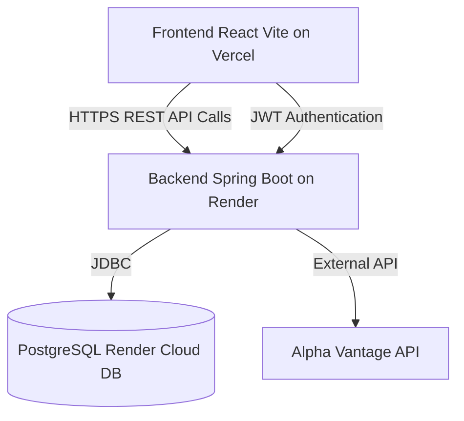
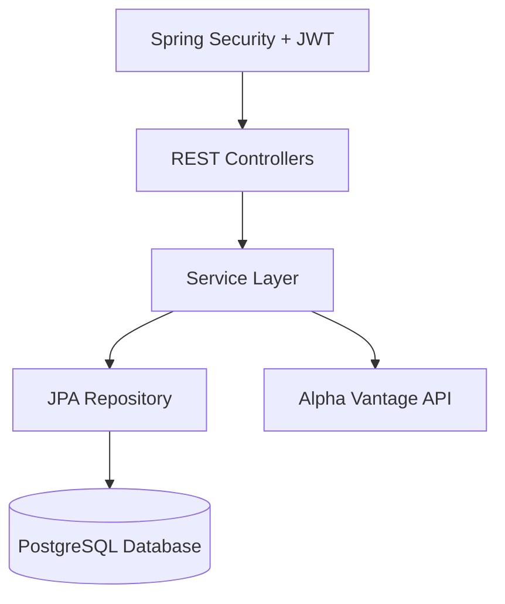
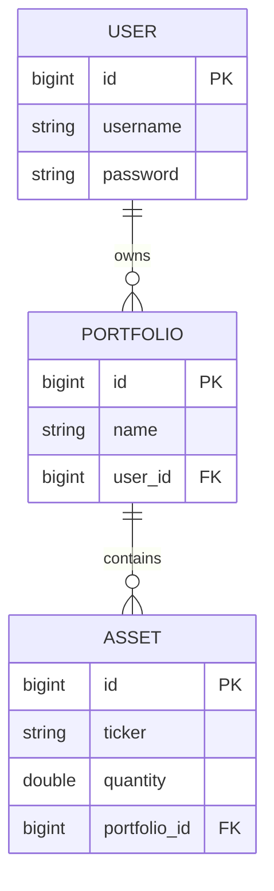
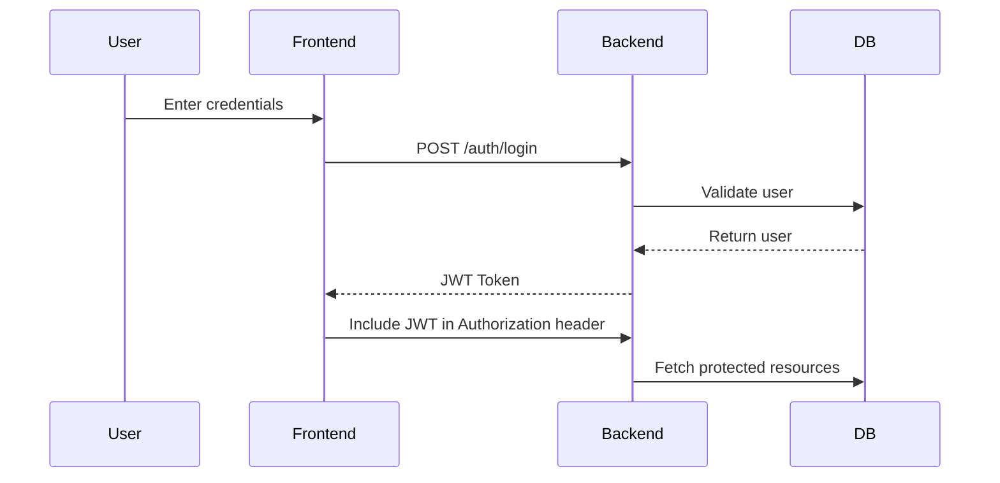
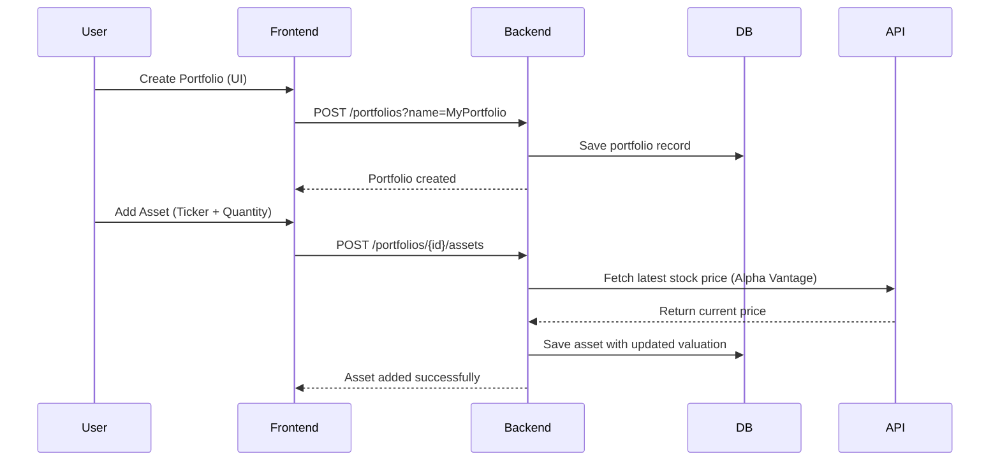
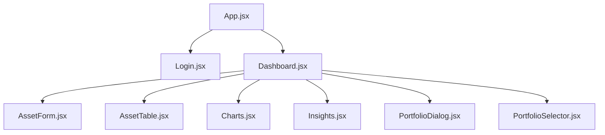

# 💼 Financial Portfolio Tracker

A **full-stack financial portfolio management platform** built using **React (Vite)**, **Spring Boot**, and **PostgreSQL**, enabling users to **create and manage portfolios, track real-time asset performance**, and receive **intelligent diversification insights** — powered by the **Alpha Vantage API**.

---

## 🚀 Live Deployment

| Service | Platform | Link |
|----------|-----------|------|
| 🌐 Frontend | **Vercel** | [https://financial-portfolio-tracker-omega.vercel.app](https://financial-portfolio-tracker-omega.vercel.app) |
| ⚙️ Backend | **Render** | [https://financialportfoliotracker-v5d8.onrender.com](https://financialportfoliotracker-v5d8.onrender.com) |
| 💾 Database | **Render PostgreSQL** | Managed Cloud DB |

---

## 🧩 Overview

The **Financial Portfolio Tracker** allows users to:
- ✅ Register & login securely using **JWT Authentication**
- 📈 Create and manage multiple investment portfolios
- 💰 Add assets and view their **real-time valuations**
- 📊 Visualize performance using **interactive charts**
- 🤖 Get diversification insights powered by the **Alpha Vantage API**

---

## ⚙️ Tech Stack

### 🔹 Frontend
- React (Vite)
- Material UI (MUI)
- Axios & React Query
- Recharts (for Charts)
- Redux Toolkit

### 🔹 Backend
- Spring Boot (Java 21)
- Spring Security + JWT Authentication
- Spring Data JPA
- PostgreSQL (Cloud DB)
- Maven
- Alpha Vantage API (External)

### 🔹 Deployment
- **Frontend:** Vercel  
- **Backend:** Render  
- **Database:** Render PostgreSQL  

---

## 🏗️ System Architecture

### 🔹 High-Level Architecture

### 🔹 Backend Architecture

### 🔹 Entity Relationship Diagram

### 🔹 Authentication & Data Flow

### 🔹 Portfolio Management Flow

### 🔹 Frontend Component Hierarchy

